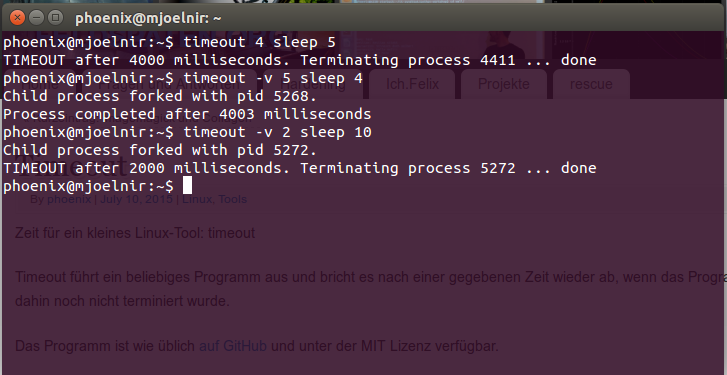

# timeout

Tool to execute arbitrary programs with a given timeout

## Usage

    timeout [OPTIONS] TIMEOUT PROGRAM [ARGUMENTS]
    
    Synopsis
    
    OPTIONS:
      -v   --verbose      Turn verbosity on (including runtime)
      -9   --kill         On timeout, send SIGKILL instead of SIGTERM
      -h   --help         Display help message
    
    TIMEOUT is given in seconds
    PROGRAM is the program that is executed with the given timeout
    ARGUMENTS are optional arguments passed to the program

A example would be

    timeout 3 sleep 5
    # Run 'sleep 5' for 3 seconds, then terminate

## Compile

    make
    sudo make install    # Installs the program to /usr/local/bin

## Screenshot

## License

This work is licensed under the MIT license (http://opensource.org/licenses/MIT)

2019, Felix Niederwanger, http://feldspaten.org
